---

### :man_technologist: À propos de moi :

Salut, je suis un développeur passionné . J'aime résoudre des problèmes complexes et créer des applications innovantes.

- :computer: Je suis actuellement spécialisé en JavaScript et avec Docker, j'apprends le Rust.
- :video_game: J'ai des compétences avec Unreal Engine et j'adore créer des jeux.
- :books: Dans mon temps libre, j'aime apprendre de nouvelles technologies et approfondir mes connaissances actuelles.
- :mailbox: [Envoyez-moi un email](mailto:grifed@pureidea.fr)

---

## 🌐 Réseaux:

---
### :hammer_and_wrench: Langages et outils :

---

---

#### Outils de développement

#### Développement de jeux

---

## 📊 GitHub Stats:

	

	

---

	

